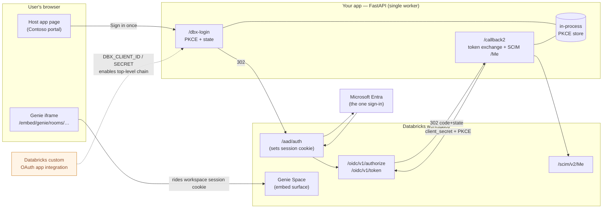

# Genie SSO Embedding — zero-popup single sign-on

A reference implementation for embedding a **Databricks AI/BI Genie Space** inside an
external web app (Salesforce, a portal, any custom UI) with **one sign-in and no popups**.

The hard problem this solves: the embedded Genie iframe can never be authenticated by
the host app's own login, and Microsoft Entra refuses to render its interactive sign-in
inside an iframe (`X-Frame-Options: DENY`, even with third-party cookies enabled). The
naive result is a *double login* — the user signs into your app, then Databricks prompts
them again inside the frame.

This app shows three approaches side by side so the difference is obvious in a demo:

| Route | Name | Experience |
|-------|------|------------|
| `/v0` | **Zero-friction SSO** | One sign-in, one top-level redirect chain, then the Genie iframe just loads. **This is the fix.** |
| `/v2` | Popup bootstrap | A brief self-closing popup mints the Databricks session top-level, then the iframe loads. The best you can do *without* OAuth registration. |
| `/v3` | Current experience | The iframe triggers the Databricks sign-in in-frame — the double login customers complain about today. |

> The UI is themed as a fictional "Contoso Analytics Portal" so it reads as a
> customer app, not a Databricks page.

## Architecture



The **OAuth app integration** (dashed) is registration, not a runtime hop — but it's the
enabling piece: without it the whole top-level redirect chain can't exist, and you fall
back to a popup. Everything the browser sees happens as one chain of top-level 302s; the
iframe never carries the auth itself, it just reuses the workspace session cookie planted
along the way.

---

## How the zero-popup flow works (`/v0`)

The key insight: **register the external app as a Databricks custom OAuth app
integration** on the account. Because the app is now a first-class OAuth client of the
Databricks workspace, a single top-level OAuth redirect chain both authenticates the user
*and* sets the Databricks workspace session cookie as a side effect. After that, the
native Genie iframe loads directly against that already-established session — no popup, no
second prompt.


### The components that make it work

1. **Databricks custom OAuth app integration** — the app is registered as an OAuth
   client on the Databricks *account* (one POST to
   `/api/2.0/accounts/{account_id}/oauth2/custom-app-integrations`). This yields the
   `DBX_CLIENT_ID` / `DBX_CLIENT_SECRET` and lets the redirect chain run top-level. Without
   this registration there is no way to establish the session in a single non-popup hop.

2. **`/aad/auth?next_url=…` wrapping the OIDC authorize call** (`app.py`, `/dbx-login`).
   The app redirects to the workspace `/aad/auth` endpoint with `next_url` set to a
   **base64-encoded** relative `/oidc/v1/authorize?…` URL. `/aad/auth` drives the Entra
   sign-in *and* plants the workspace session cookie, then forwards to the OIDC authorize
   endpoint — all in one top-level chain. The base64 **must be percent-encoded** because it
   contains `+ / =`.

3. **PKCE (S256) + `state`** — the app generates a code verifier/challenge per request and
   keeps the verifier keyed by a `state` nonce (`_PKCE` dict). Standard OAuth CSRF and
   code-interception protection.

4. **Minimal scope: `iam.current-user:read`** — the token is only used to identify the
   user via SCIM `/Me`; the Genie iframe rides the browser's workspace session, *not* this
   token. Narrow scope keeps the one-time Databricks consent screen benign (no scary
   "all-apis" warning).

5. **Token exchange at `/oidc/v1/token`** (`app.py`, `/callback2`) with
   `client_secret` + PKCE `code_verifier`, then **SCIM `/api/2.0/preview/scim/v2/Me`** to
   resolve the signed-in user's email. Identity is stored in a signed `dbx_session` cookie.

6. **The `/embed/genie/rooms/{space_id}?o={org_id}` URL** — the *embeddable* Genie surface
   (serves `frame-ancestors *`), **not** the plain `/genie/rooms/{id}` room URL (which has a
   fixed frame-ancestors allow-list and refuses to load in a third-party iframe).

### Two prerequisites outside the code

- **Third-party cookies must be allowed** by the browser/IT policy, so the iframe can use
  the Databricks session cookie. (Chrome blocks these in Incognito; Safari blocks by
  default.)
- **Workspace embedding must be enabled**: the `AibiDashboardEmbeddingAccessPolicy`
  workspace setting must be `ALLOW_ALL` or `ALLOW_APPROVED_DOMAINS` (with your app's domain
  approved). If it's unset/deny, the iframe renders "Embedding Genie Spaces is not available
  in this workspace" even when the SSO chain is perfect.

---

## Running it

### Configure

```bash
cp .env.example .env
# fill in the SSO_* + DBX_* values from your OAuth app integration, and the
# Genie Space / workspace details. See .env.example for every variable.
```

### Local

```bash
pip install -r requirements.txt
set -a; source .env; set +a
uvicorn app:app --host 0.0.0.0 --port 8000
# open http://localhost:8000  (for real SSO, run behind an HTTPS host so the
# cookies' Secure flag is honored and the redirect URIs match)
```

### Azure App Service (Linux, Python)

`startup.sh` is the startup command:

```bash
gunicorn app:app --workers 1 --worker-class uvicorn.workers.UvicornWorker --bind 0.0.0.0:8000
```

**One worker on purpose** — the PKCE verifier store is in-process and must be authoritative
across the `/dbx-login` → `/callback2` round trip. Set the `.env` values as App Service
application settings.

Health check: `GET /healthz` → `{"ok": true, "sso_enabled": true|false}`. If
`sso_enabled` is `false`, one or more `SSO_*` / `DBX_*` variables are missing and `/v0`
shows "Not configured".

---

## Registering the Databricks OAuth app integration

The zero-popup flow needs the app registered as a custom OAuth app integration on the
Databricks account. Roughly:

```bash
curl -X POST \
  https://accounts.<cloud>.databricks.com/api/2.0/accounts/{account_id}/oauth2/custom-app-integrations \
  -H "Authorization: Bearer <account-admin-token>" \
  -d '{
        "name": "genie-sso-embedding",
        "redirect_urls": ["https://<your-app-host>/callback2"],
        "scopes": ["iam.current-user:read", "offline_access"],
        "confidential": true
      }'
```

The response's `client_id` / `client_secret` become `DBX_CLIENT_ID` / `DBX_CLIENT_SECRET`,
and the redirect URL must match `SSO_REDIRECT_URI` exactly.

> Note: this was originally built and verified on an ephemeral OneEnv Azure sandbox, where
> account-level objects are auto-deleted after ~14 days. If you're demoing on that kind of
> environment, expect to re-register the integration per demo — it's a single POST.

---

## Files

| File | Purpose |
|------|---------|
| `app.py` | The whole app — all three flows, the redirect chain, token exchange, and the themed UI. |
| `requirements.txt` | FastAPI + uvicorn/gunicorn + requests + itsdangerous. |
| `startup.sh` | Azure App Service startup command (single gunicorn worker). |
| `.env.example` | Every environment variable, documented. |

## Not included

The Genie **Conversation API** variant (a custom chat UI calling the REST API with an Entra
token instead of using the iframe) is intentionally omitted — this repo is specifically
about making the **native iframe** embed work with a single sign-in.
