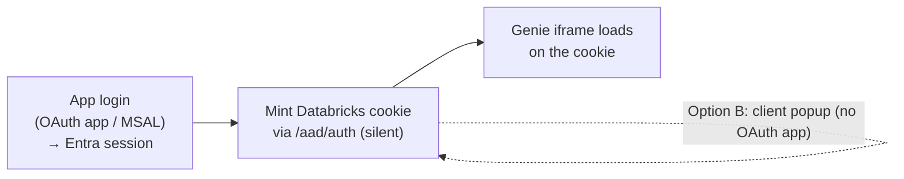
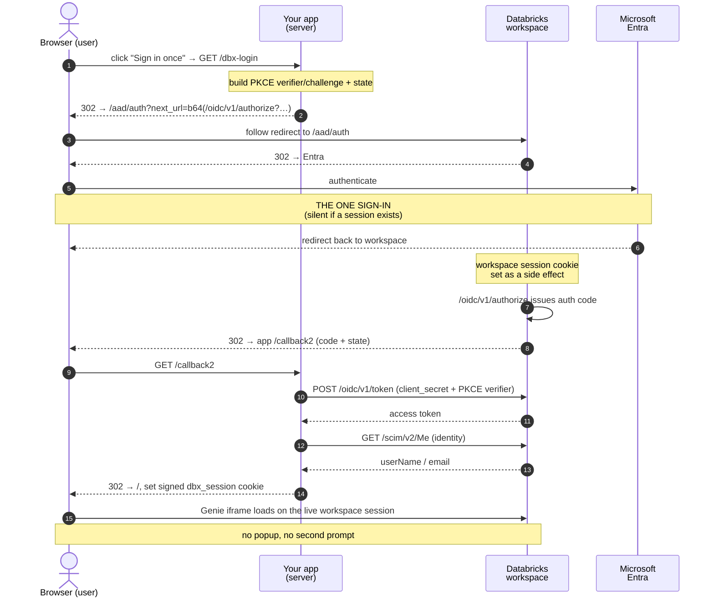

# Genie SSO Embedding — sign into your app once, no second login for Genie

A reference implementation for embedding a **Databricks AI/BI Genie Space** inside an
external web app (Salesforce, a portal, any custom UI) so that a user who has signed into
the app is **not prompted to sign in again** when the Genie iframe loads.

## The problem

The embedded Genie iframe can never be authenticated by the host app's own login, and
Microsoft Entra refuses to render its interactive sign-in inside an iframe
(`X-Frame-Options: DENY`, even with third-party cookies enabled). So the naive result is a
**double login** — the user signs into your app, then Databricks prompts them again inside
the frame.

The root cause, stated precisely:

> A Genie iframe authenticates with a **Databricks session cookie** — *not* a Bearer token.
> App logins (including MSAL) produce an **Entra session + token**, which the iframe cannot
> use. So unless something mints the Databricks cookie, the frame falls through to
> Databricks' own login.

The fix is always the same shape: **mint the Databricks session cookie once, top-level, by
hitting the workspace `/aad/auth` endpoint.** Because the user already has an Entra session
(from the app login), that `/aad/auth` → Entra hop is **silent** — no re-typing. The iframe
then loads against the cookie.

This repo ships **two ways** to run that cookie-mint step. They differ in one thing: whether
you need a Databricks **account-admin** to register an OAuth app.

---

## The two options

| | **Option A — OAuth app (server-side)** | **Option B — Popup bootstrap (client-side)** |
|---|---|---|
| How the cookie is minted | A server route runs a confidential-OAuth redirect chain through `/aad/auth` and back | A brief top-level popup opens `/aad/auth`, then auto-closes |
| Databricks **account-admin** needed? | **Yes** — register a custom OAuth app integration | **No** |
| User experience | Fully seamless — a top-level redirect, no popup | A short popup window flashes and closes itself |
| Where it lives | Python app (`app.py` + `genie_sso.py`), **and** the Next.js `server` mint mode | Next.js `popup` mint mode |
| Client secret | Stays server-side (confidential client) | None needed |

**Both** require third-party cookies to be allowed for the workspace domain (see
[prerequisites](#prerequisites-both-options)). Pick **A** when you can get account-admin and
want zero popups; pick **B** when you can't and a brief popup is acceptable.



---

## Option A — OAuth app (server-side, zero-popup)

The app is registered as a Databricks **custom OAuth app integration**, so a single
top-level redirect chain both authenticates the user *and* sets the Databricks session
cookie as a side effect. This is the seamless path; it requires an account-admin to create
the integration.



### The components that make it work

1. **Databricks custom OAuth app integration** — registered on the Databricks *account*
   (one POST to `/api/2.0/accounts/{account_id}/oauth2/custom-app-integrations`). Yields the
   `DBX_CLIENT_ID` / `DBX_CLIENT_SECRET` and lets the redirect chain run top-level. **This is
   the account-admin step**, and it is per-account — an integration registered on one
   account is not valid on another.

2. **`/aad/auth?next_url=…` wrapping the OIDC authorize call** (`genie_sso.py`, `_login`).
   The app redirects to the workspace `/aad/auth` with `next_url` set to a
   **base64-encoded** relative `/oidc/v1/authorize?…` URL. `/aad/auth` drives the Entra
   sign-in *and* plants the workspace session cookie, then forwards to OIDC authorize — one
   top-level chain. The base64 **must be percent-encoded** (it contains `+ / =`).

3. **PKCE (S256) + `state`** — a verifier/challenge per request, verifier kept keyed by the
   `state` nonce. Standard OAuth CSRF + code-interception protection.

4. **Minimal scope `iam.current-user:read`** — the token only identifies the user via SCIM
   `/Me`; the iframe rides the browser cookie, not this token. Narrow scope keeps the
   one-time Databricks consent screen benign.

5. **Token exchange at `/oidc/v1/token`** (`_callback`) with `client_secret` + PKCE
   `code_verifier`, then **SCIM `/api/2.0/preview/scim/v2/Me`** for identity, stored in a
   signed `dbx_session` cookie.

> ⚠️ **One host variable drives two things.** `SSO_WS_HOST` sets *both* the `/aad/auth`
> sign-in host *and* the embed iframe host. Because the OAuth app is registered per-account,
> you cannot point `SSO_WS_HOST` at a workspace whose account lacks the registered client —
> the authorize step returns `invalid_client`. Sign-in host and embed host must be the same
> workspace, on the account where the OAuth app is registered.

### Register the OAuth app integration

```bash
curl -X POST \
  https://accounts.<cloud>.databricks.com/api/2.0/accounts/{account_id}/oauth2/custom-app-integrations \
  -H "Authorization: Bearer <account-admin-token>" \
  -d '{
        "name": "genie-sso-embedding",
        "redirect_urls": ["https://<your-app-host>/callback2"],
        "scopes": ["iam.current-user:read", "offline_access"],
        "confidential": true
      }'
```

The response's `client_id` / `client_secret` become `DBX_CLIENT_ID` / `DBX_CLIENT_SECRET`;
the redirect URL must match `SSO_REDIRECT_URI` exactly.

### Run the Python app (Option A reference implementation)

```bash
cp .env.example .env         # fill in SSO_* + DBX_* (see .env.example)
pip install -r requirements.txt
set -a; source .env; set +a
uvicorn app:app --host 0.0.0.0 --port 8000
```

Deployed on Azure App Service via `startup.sh`:

```bash
gunicorn app:app --workers 1 --worker-class uvicorn.workers.UvicornWorker --bind 0.0.0.0:8000
```

**One worker on purpose** — the PKCE verifier store is in-process and must be authoritative
across the `/dbx-login` → `/callback2` round trip. (For multi-worker deployments, pass
`GenieSSO(pkce_store=…)` a shared backend like Redis.)

Health check: `GET /healthz` → `{"ok": true, "sso_enabled": true|false}`. When
`sso_enabled` is `false`, an `SSO_*` / `DBX_*` value is missing and the app shows
"Not configured".

The SSO machinery is extracted into `genie_sso.py` (`GenieSSO` / `GenieSSOConfig`); `app.py`
is a thin host that owns the branded UI and mounts `sso.router`.

---

## Option B — Popup bootstrap (client-side, no account-admin)

When you **can't** get account-admin, skip the OAuth app entirely. After the app's own login
(e.g. MSAL) establishes the Entra session, the client opens a **brief top-level popup** to
`/aad/auth`; it completes silently (Entra session already exists), sets the Databricks
cookie, and auto-closes. Then the iframe loads.

```
App login (MSAL) → [popup] /aad/auth (silent) → cookie set → popup closes → iframe loads
   (Entra session)                                                            (no 2nd login)
```

The tradeoff is only cosmetic: a small window flashes for a second or two. No OAuth app, no
client secret, no account-admin.

This mode lives in the **Next.js PoC** (`poc-msal-iframe/`), which mirrors GSK's own MSAL +
Microsoft Graph group-gating pattern and adds the cookie-mint step. See
[`poc-msal-iframe/README.md`](poc-msal-iframe/README.md) for details. The PoC supports
*both* options via `NEXT_PUBLIC_MINT_MODE=server|popup`, so it's also a working Option-A
implementation in TypeScript (`lib/genieSso.ts` + `app/api/*` run the server chain inside
Next.js route handlers, keeping the client secret server-side).

---

## Prerequisites (both options)

- **Third-party cookies must be allowed** for the Databricks workspace domain in the
  browser, so the iframe can use the Databricks session cookie. Chrome blocks them in
  Incognito; Safari blocks by default. **If IT policy blocks them, no option works** — the
  in-frame second login returns. This is a browser security boundary, not a code problem,
  and is the single biggest thing to verify with enterprise IT before promising the flow.
- **Workspace embedding must be enabled**: the `AibiDashboardEmbeddingAccessPolicy`
  workspace setting must be `ALLOW_ALL_DOMAINS` or `ALLOW_APPROVED_DOMAINS` (with your app's
  domain approved). Otherwise the iframe renders "Embedding Genie Spaces is not available in
  this workspace" even when the SSO chain is perfect.
- **Use the `/embed/genie/rooms/{space_id}?o={org_id}` URL** — the embeddable surface
  (serves `frame-ancestors *`), *not* the plain `/genie/rooms/{id}` room URL (fixed
  frame-ancestors allow-list; refuses to load in a third-party iframe).

> The Genie space only needs to **render** — it does not need working query storage. A space
> on a workspace with broken result storage still demonstrates the sign-in/embed flow; only
> live query answers would be affected.

---

## Repository layout

| Path | What it is |
|------|------------|
| `app.py` | Option A host app (FastAPI) — branded "Contoso Analytics Portal" UI. |
| `genie_sso.py` | Option A SSO library (`GenieSSO`/`GenieSSOConfig`): PKCE, `/aad/auth` chain, token exchange, SCIM identity, signed cookies. |
| `requirements.txt`, `startup.sh` | Python deps + Azure App Service startup command. |
| `.env.example` | Every environment variable for the Python app, documented. |
| `poc-msal-iframe/` | Next.js PoC mirroring GSK's MSAL + Graph group-gating, supporting **both** options via `NEXT_PUBLIC_MINT_MODE`. Has its own README. |

## Not included

The Genie **Conversation API** variant (a custom chat UI calling the REST API with an Entra
token instead of using the iframe) is intentionally omitted — this repo is specifically
about making the **native iframe** embed work with a single sign-in.
